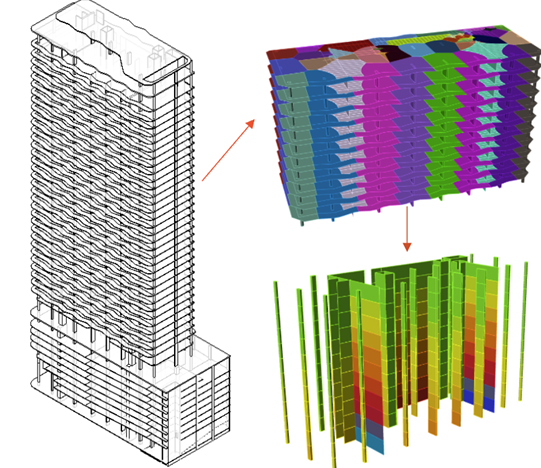

---
layout:
  title:
    visible: true
  description:
    visible: false
  tableOfContents:
    visible: true
  outline:
    visible: true
  pagination:
    visible: true
---

# Welcome to Column Load Takedown Application !

The **Column Load Takedown Application (CLTA)** is designed to streamlines early structural analysis by providing engineers with preliminary load take-down assessments from raw Revit models. Ideal for scenarios lacking a full analytical model, it offers a tentative solution to accelerate the evaluation process.

<figure><figcaption>
Column Load Takedown Application
</figcaption></figure>

### What does it offer?

* Enables initial load estimations, crucial for early structural analysis.
* Utilizes raw Revit models to generate close load estimations, providing a reliable starting point.
* Speeds up the assessment process, allowing engineers to quickly establish a basis for more detailed analysis.

### CLTA Revit Supported Versions

* Revit 2024
* Revit 2025

### CLTA Rhino/Grasshopper Supported Versions

* Rhinoceros 7 (Grasshopper 1.0.0007)
* Rhinoceros 8 (Grasshopper 1.0.0008)
