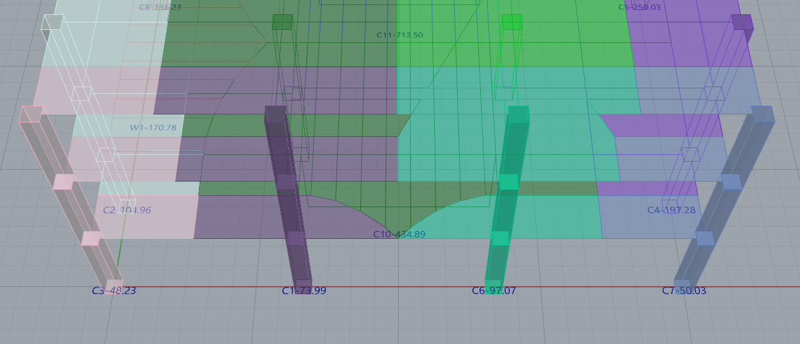
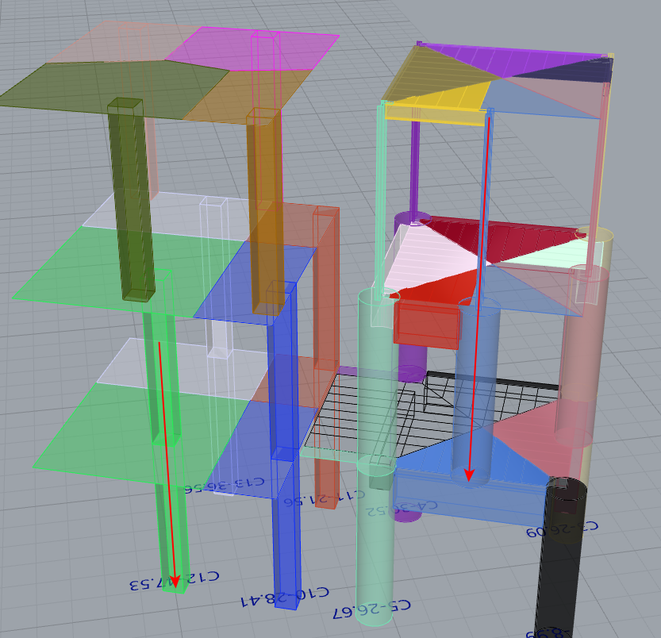

---
layout:
  title:
    visible: true
  description:
    visible: false
  tableOfContents:
    visible: true
  outline:
    visible: true
  pagination:
    visible: true
---

# Outputs

**Column Load Takedown Application** generates detailed results based on the input data, including tributary areas, load distribution per column and graphical representations of load paths inside Rhinoceros environment.

<figure><figcaption>
Columns and Walls axial loads are provided (kips)
</figcaption></figure>

The **Column Load Takedown Application (CTLA)** visualizes load paths through a color-coded system, making it easier to identify varying load intensities across different columns and floors. This graphical representation helps engineers quickly assess critical load areas and adjust designs accordingly for optimal structural performance.

<figure><figcaption>
Load paths
</figcaption></figure>
