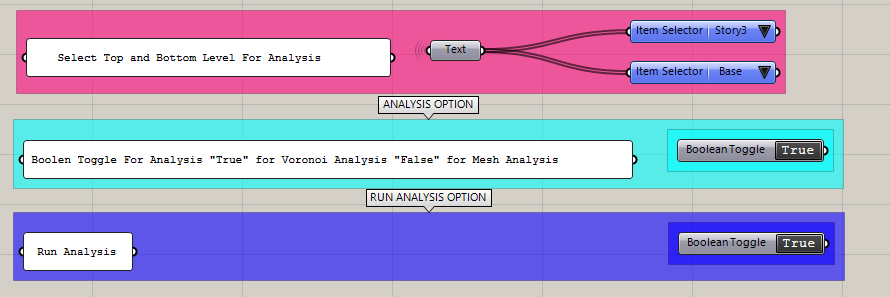

---
layout:
  title:
    visible: true
  description:
    visible: false
  tableOfContents:
    visible: true
  outline:
    visible: true
  pagination:
    visible: true
---

# Quickstart

Getting started by providing inputs for the script:

* **Level**: Determine Bottom Level and Top Level to be used for the analysis.
* **Analysis Option**: Toggle between Voronoi or Mesh analysis.
* **Run**: Toggle to run the analysis.

<figure><figcaption>
Initial Component
</figcaption></figure>
